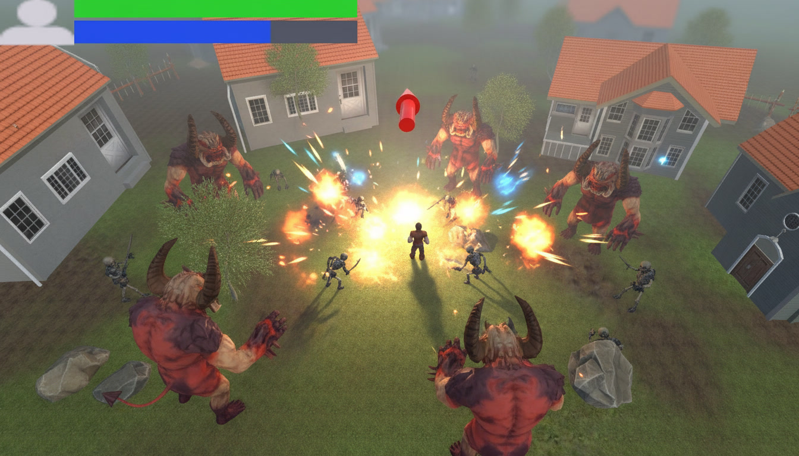
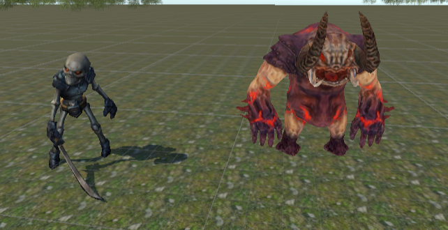
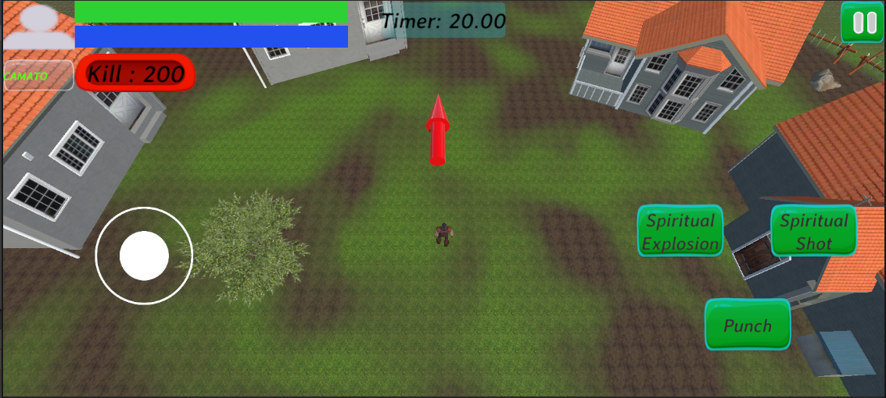
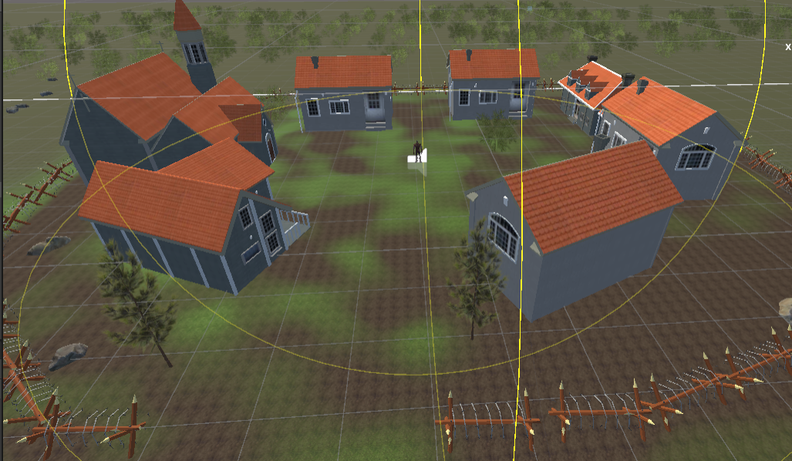

<div align="center">

# 🛡️ The Last Guardian
### *(nom de code : Protect your village)*



**Un action-RPG top-down où le dernier gardien d'un village doit repousser des vagues d'ennemis grâce à l'épée et à la magie ancestrale.**

🏆 *Projet primé lors de plusieurs compétitions — actuellement en cours d'évolution pour une future compétition.*

[Lien du projet](https://github.com/CamatoDev/Vortex-Makers) · [Auteur](https://github.com/CamatoDev)

</div>

---

## 🎬 Aperçu du jeu

<div align="center">

<video controls src="Assets/_Game/UIs/Vidéo/The Last Guardian 1.mp4" title="Vidéo Démo"></video>


| Vue des ennemis | Interface dans un niveau | Vue d'ensemble du village |
|:---:|:---:|:---:|
|  |  |  |

</div>
remplace les blocs ci-dessus par ``

---

## 📖 Sommaire

- [Concept du jeu](#-concept-du-jeu)
- [Piliers de conception](#-piliers-de-conception)
- [Fonctionnalités](#-fonctionnalités)
- [Architecture technique du projet](#-architecture-technique-du-projet)
- [Installation](#-installation)
- [Environnement technique](#-environnement-technique)
- [Assets utilisés](#-assets-utilisés)
- [Évolutions prévues](#-évolutions-prévues)
- [FAQ](#-faq)
- [Auteur](#-auteur)

---

## 🎮 Concept du jeu

Le joueur incarne un combattant, dernier détenteur de techniques et de sorts ancestraux, chargé de protéger son village contre des vagues d'ennemis venus l'envahir.

Vu en **top-down**, le joueur explore un environnement semé de pièges, de cachettes et de bonus, et doit repousser chaque vague avant que les assaillants n'atteignent les limites du village — synonyme de défaite immédiate.

Le gameplay repose sur un équilibre à gérer en temps réel entre :
- **la vie**, qui détermine la survie du joueur ;
- **l'énergie spirituelle (mana)**, qui alimente les sorts à distance ;
- **la pression ennemie**, qui augmente vague après vague et pousse le joueur à alterner entre offensive, repli et récupération de ressources.

---

## 🧱 Piliers de conception

| Pilier | Description |
|---|---|
| **La magie** | Le joueur peut projeter des boules d'énergie sur ses ennemis, avec une variante plus puissante à effet de zone. |
| **La défense de zone** | Une frontière invisible délimite le village ; si un seul ennemi la franchit, la partie est perdue. |
| **Les vagues d'ennemis** | Les assaillants arrivent par vagues successives et configurables, laissant au joueur des fenêtres de répit pour se réorganiser. |

---

## ⚔️ Fonctionnalités

### Déplacement & combat au corps-à-corps
- Déplacement fluide au **joystick virtuel**, avec rotation automatique du personnage dans la direction du mouvement.
- **Ciblage automatique** de l'ennemi le plus proche dans un rayon donné (recalculé à intervalle régulier pour rester performant), avec verrouillage progressif de l'orientation du joueur vers sa cible.
- **Attaque au corps-à-corps** déclenchée par bouton, basée sur un raycast devant le joueur, avec **cooldown** empêchant le spam.
- Caméra qui suit le joueur sur les axes X/Z pour garder l'action toujours centrée.

### Magie & compétences spirituelles
- **Tir spirituel** : projectile qui recherche automatiquement la cible verrouillée, coûte de l'énergie spirituelle et inflige des dégâts directs.
- **Explosion spirituelle** : variante plus coûteuse en mana, capable d'infliger des dégâts en zone (AoE) à tous les ennemis dans un rayon d'impact.
- Chaque compétence dispose de son **propre cooldown**, matérialisé par la désactivation temporaire du bouton correspondant à l'écran.
- La barre d'énergie spirituelle se régénère progressivement dans la **zone du village** (voir plus bas).

### Vie, dégâts et résistance
- Système de **vie et de mana** avec barres d'interface mises à jour en temps réel.
- Les dégâts subis prennent en compte une **statistique d'armure**, réduisant la valeur brute infligée par les ennemis.
- Séquence de mort dédiée : désactivation de la gravité et de la collision, animation et son de mort — le joueur reste visible mais hors de portée d'interaction.

### Intelligence artificielle des ennemis
- Chaque ennemi évalue en continu sa **distance au joueur** et adapte son comportement :
  - **hors de portée de poursuite** ou joueur mort → se dirige vers le village ;
  - **à portée de poursuite** → chasse activement le joueur via NavMesh ;
  - **à portée d'attaque** → attaque à intervalle régulier, avec animation, son et transmission des dégâts (en tenant compte de l'armure du joueur).
- Chaque ennemi possède ses propres points de vie ; sa mort déclenche animation, son, décompte du nombre d'ennemis vivants et incrémentation du score de kills du joueur.

### Système de vagues
- Les vagues sont définies par des objets configurables (**préfab d'ennemi, nombre, cadence d'apparition**), permettant de composer facilement de nouveaux niveaux.
- **Trois points de spawn distincts** répartissent l'apparition des ennemis pour éviter les regroupements artificiels.
- Un minuteur affiche le temps restant avant la prochaine vague ; la vague suivante ne se déclenche qu'une fois tous les ennemis de la précédente éliminés.
- La dernière vague terminée déclenche automatiquement la **victoire du niveau**.

### Le village comme zone refuge
- Une zone circulaire autour du village **régénère progressivement la vie et le mana** du joueur lorsqu'il s'y trouve — un vrai choix stratégique entre repli tactique et pression offensive continue.
- Un indicateur d'**état critique** s'affiche à l'écran (et modifie l'ambiance sonore) lorsque la vie du joueur passe sous un seuil critique.

### Bonus et objets ramassables
- **Bonus de vie**, **bonus de mana/énergie spirituelle** et **bonus de puissance** (multiplicateur temporaire de dégâts, physiques et magiques) apparaissent aléatoirement dans une zone définie de la carte.
- Chaque bonus est consommé au contact du joueur, déclenche une animation dédiée, puis se détruit.

### Guidage visuel
- Une **flèche indicatrice** suit le joueur en permanence et pointe vers l'ennemi le plus proche, offrant un repère de portée illimitée pour anticiper les menaces.

### Progression, niveaux et interface
- Système de **sélection de niveaux** avec déverrouillage progressif basé sur la progression sauvegardée du joueur.
- Écrans de **fin de niveau** (victoire) et de **game over** (défaite), affichant le nombre d'ennemis vaincus.
- **Menu pause** interrompant le temps de jeu (`Time.timeScale`), avec options de reprise, de recommencer ou de retour au menu.
- **Menu principal** avec saisie du pseudo joueur (clavier tactile natif), réglages audio (musique/effets) et accès à un guide/tutoriel.
- **Transitions en fondu** entre les scènes, avec logo et texte de chargement, pour une expérience visuellement cohérente.

---

## 🗂️ Architecture technique du projet

Le projet est organisé autour de trois grandes familles de scripts C# :

<details>
<summary><strong>🎮 Gameplay — Joueur & Combat</strong></summary>

| Script | Rôle |
|---|---|
| `CharacterMotor.cs` | Déplacement, ciblage automatique, attaque au corps-à-corps, suivi caméra |
| `Player.cs` | Vie, mana, dégâts, armure, mort, interface (barres, pseudo, kills) |
| `SpiritualSkill.cs` | Déclenchement des sorts (tir & explosion), gestion du mana et des cooldowns |
| `SpiritBaall.cs` | Comportement du projectile magique (poursuite de cible, dégâts directs ou en zone) |

</details>

<details>
<summary><strong>👹 Gameplay — Ennemis & Vagues</strong></summary>

| Script | Rôle |
|---|---|
| `EnemyAi.cs` | Comportement IA (poursuite / attaque / repli vers le village) via NavMesh |
| `EnemySpawn.cs` | Orchestration des vagues, points de spawn multiples, minuteur |
| `Wave.cs` | Structure de données définissant une vague (ennemi, quantité, cadence) |
| `GameManager.cs` | Détection de défaite/victoire, état critique, limites du village |
| `VillageBoostEffect.cs` | Zone de régénération de vie/mana autour du village |
| `ObjectifDirection.cs` | Flèche indicatrice pointant vers l'ennemi le plus proche |

</details>

<details>
<summary><strong>🎁 Bonus & objets</strong></summary>

| Script | Rôle |
|---|---|
| `HealtBoost.cs` | Bonus de restauration de vie |
| `SpiritualBoost.cs` | Bonus de restauration de mana |
| `PowerBoost.cs` | Bonus de multiplication temporaire des dégâts |
| `SpawnBoost.cs` | Apparition aléatoire d'un bonus dans une zone définie |

</details>

<details>
<summary><strong>🖥️ Interface, menus & navigation</strong></summary>

| Script | Rôle |
|---|---|
| `MainMenu.cs` | Menu principal (jouer, options, guide, pseudo, quitter) |
| `PauseMenu.cs` / `PauseOption.cs` | Menu pause et réglages audio en jeu |
| `LevelSelector.cs` | Sélection et déverrouillage des niveaux |
| `CompleteLevel.cs` / `GameOver.cs` | Écrans de fin de niveau (victoire/défaite) |
| `SceneFader.cs` | Transitions en fondu entre les scènes |
| `SwitchPage.cs` | Navigation entre écrans (ex. pages de guide/tutoriel) |

</details>

---

## 🚀 Installation
 
Le jeu est disponible et téléchargeable directement depuis itch.io :
 
👉 **[The Last Guardian sur itch.io](https://vortex-makers.itch.io/the-last-guardian)**
 
```bash
1. Se rendre sur la page itch.io du projet
2. Télécharger l'APK
3. Transférer l'APK sur un smartphone Android (si le téléchargement
   n'a pas été effectué directement depuis l'appareil)
4. Lancer l'APK puis appuyer sur "Installer"
5. Une fois l'installation terminée, ouvrir l'application
6. Depuis le menu principal, configurer les OPTIONS souhaitées
   et consulter le GUIDE pour découvrir les commandes
7. Appuyer sur COMMENCER pour lancer une partie
```
 
## 🎥 Démo
 
Le projet est disponible en ligne sur itch.io :
 
👉 **[https://vortex-makers.itch.io/the-last-guardian](https://vortex-makers.itch.io/the-last-guardian)**
 
---
 
## 🛠️ Environnement technique
 
- **Moteur** : Unity 2020.3.35f1 (64-bit)
- **Langage** : C#
- **Plateforme cible** : Android
- **Navigation IA** : NavMesh Agent (Unity AI)
- **Entrées** : Joystick virtuel tactile
---
 
## 🔗 Assets utilisés
 
| Catégorie | Lien |
|---|---|
| Interface (UI) | [Marklight](https://assetstore.unity.com/packages/tools/gui/marklight-37466) |
| Joystick virtuel | [Joystick Pack](https://assetstore.unity.com/packages/tools/input-management/joystick-pack-107631) |
| Personnage principal | [Modular Character Fantasy RPG](https://assetstore.unity.com/packages/3d/characters/humanoids/humans/free-modular-character-fantasy-rpg-human-male-228952) |
| Monstres | [Golem Monster](https://assetstore.unity.com/packages/3d/characters/creatures/golemmonster-33260) · [Fantasy Monster Skeleton](https://assetstore.unity.com/packages/3d/characters/humanoids/fantasy-monster-skeleton-35635) |
| Environnement | [Yughues Free Ground Materials](https://assetstore.unity.com/packages/2d/textures-materials/floors/yughues-free-ground-materials-13001) · [House Pack](https://assetstore.unity.com/packages/3d/environments/house-pack-35346) · [Mobile Tree Package](https://assetstore.unity.com/packages/3d/vegetation/trees/mobile-tree-package-18866) · [Rock Package](https://assetstore.unity.com/packages/3d/props/exterior/rock-package-118182) · [Low Poly Barriers Pack](https://assetstore.unity.com/packages/3d/props/exterior/low-poly-barriers-pack-free-201810) |
 
---
 
## 🧭 Évolutions prévues
 
Dans le cadre de sa prochaine évolution pour une future compétition, le projet prévoit notamment :
 
- [ ] **Amélioration visuelle du village** — refonte graphique de la zone refuge du joueur.
- [ ] **Meilleure répartition des objets dans le village** — agencement plus naturel des décors et éléments pour donner un effet plus vivant et habité.
- [ ] **Changement du modèle du personnage principal** — nouveau design pour le héros incarné par le joueur.
- [ ] **Ajout de nouveaux ennemis** — diversification des types d'adversaires et de leurs comportements.
- [ ] **Ajout de plusieurs niveaux** — extension du contenu jouable avec de nouvelles cartes et vagues.
---
 
## ❓ FAQ
 
#### Le jeu est-il jouable hors ligne ?
Non, le jeu est uniquement jouable en ligne.
 
#### Sur quels appareils le jeu a-t-il été testé ?
Le jeu a été testé uniquement sous Android.
 
---
 
## 👤 Auteur
 
- [@CamatoDev](https://github.com/CamatoDev)